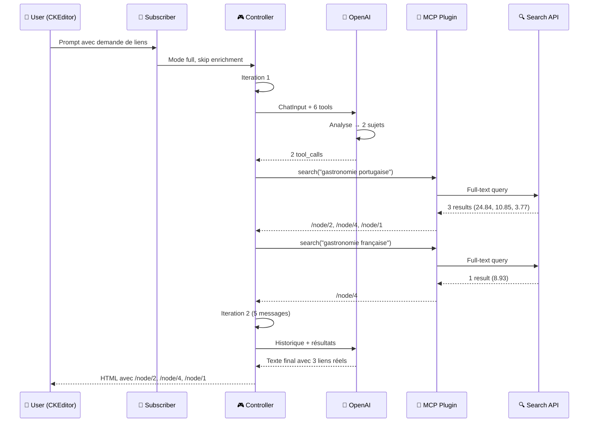

# Architecture du module AI

## Vue d'ensemble

Le module AI fournit une couche d'abstraction unifiée pour l'intégration de services d'intelligence artificielle dans Drupal. Il permet aux développeurs de créer des applications utilisant différents fournisseurs d'IA sans dépendre d'une implémentation spécifique.

## Configuration requise

- Drupal 10.4+ ou Drupal 11+
- Module Key (key:key)
- Au moins un fournisseur d'IA configuré

## Dépendances PHP

- league/html-to-markdown: ^5.1
- yethee/tiktoken: ^0.5.1
- openai-php/client: >=v0.10.1

## Architecture principale

### 1. Système de plugins

Le module repose sur un système de plugins permettant d'étendre les fonctionnalités :

#### Fournisseurs d'IA (AI Providers)

**Interface** : `Drupal\ai\AiProviderInterface`

**Classe de base** : `Drupal\ai\Base\AiProviderClientBase`

**Plugin Manager** : `Drupal\ai\AiProviderPluginManager`

Les fournisseurs implémentent les différents types d'opérations supportés par le module.

#### Fournisseurs de bases de données vectorielles (VDB Providers)

**Interface** : `Drupal\ai\AiVdbProviderInterface`

**Classe de base** : `Drupal\ai\Base\AiVdbProviderClientBase`

**Plugin Manager** : `Drupal\ai\AiVdbProviderPluginManager`

Gère le stockage et la recherche d'embeddings dans des bases de données vectorielles.

### 2. Types d'opérations

Le module définit plusieurs types d'opérations standardisées :

#### Chat

- **Interface** : `Drupal\ai\OperationType\Chat\ChatInterface`
- **Description** : Conversations avec des modèles de langage
- **Capacités** : Streaming, tools/function calling, historique de conversation

#### Embeddings

- **Interface** : `Drupal\ai\OperationType\Embeddings\EmbeddingsInterface`
- **Description** : Génération de vecteurs d'embeddings pour du texte
- **Usage** : Recherche sémantique, similarité de documents

#### Text to Image

- **Interface** : `Drupal\ai\OperationType\TextToImage\TextToImageInterface`
- **Description** : Génération d'images à partir de descriptions textuelles

#### Image to Image

- **Interface** : `Drupal\ai\OperationType\ImageToImage\ImageToImageInterface`
- **Description** : Transformation d'images existantes

#### Speech to Text

- **Interface** : `Drupal\ai\OperationType\SpeechToText\SpeechToTextInterface`
- **Description** : Transcription audio vers texte

#### Text to Speech

- **Interface** : `Drupal\ai\OperationType\TextToSpeech\TextToSpeechInterface`
- **Description** : Synthèse vocale à partir de texte

#### Moderation

- **Interface** : `Drupal\ai\OperationType\Moderation\ModerationInterface`
- **Description** : Vérification de contenu inapproprié

#### Image Classification

- **Interface** : `Drupal\ai\OperationType\ImageClassification\ImageClassificationInterface`
- **Description** : Classification automatique d'images

#### Translate Text

- **Interface** : `Drupal\ai\OperationType\TranslateText\TranslateTextInterface`
- **Description** : Traduction automatique de texte

#### Audio to Audio

- **Interface** : `Drupal\ai\OperationType\AudioToAudio\AudioToAudioInterface`
- **Description** : Transformation de fichiers audio

#### Speech to Speech

- **Interface** : `Drupal\ai\OperationType\SpeechToSpeech\SpeechToSpeechInterface`
- **Description** : Traduction de parole vers parole

#### Image to Video

- **Interface** : `Drupal\ai\OperationType\ImageToVideo\ImageToVideoInterface`
- **Description** : Génération de vidéos à partir d'images

#### Image and Audio to Video

- **Interface** : `Drupal\ai\OperationType\ImageAndAudioToVideo\ImageAndAudioToVideoInterface`
- **Description** : Combinaison d'images et audio en vidéo

### 3. System de Function Calling

#### Function Call Plugins

**Interface** : `Drupal\ai\Service\FunctionCalling\FunctionCallInterface`

**Classe de base** : `Drupal\ai\Base\FunctionCallBase`

**Plugin Manager** : `Drupal\ai\Service\FunctionCalling\FunctionCallPluginManager`

Permet aux modèles d'IA d'invoquer des fonctions PHP définies pour étendre leurs capacités.

#### Function Groups

**Plugin Manager** : `Drupal\ai\Service\FunctionCalling\FunctionGroupPluginManager`

Organise les fonctions en groupes logiques pour une meilleure gestion.

### 4. Mémoire court terme (Short Term Memory)

**Interface** : `Drupal\ai\Plugin\AiShortTermMemory\AiShortTermMemoryInterface`

**Classe de base** : `Drupal\ai\Base\AiShortTermMemoryPluginBase`

**Plugin Manager** : `Drupal\ai\PluginManager\AiShortTermMemoryPluginManager`

Gère l'historique des conversations et le contexte entre les appels.

### 5. Services principaux

#### ai.provider

Service de gestion des fournisseurs d'IA.

#### ai.vdb_provider

Service de gestion des bases de données vectorielles.

#### ai.prompt_manager

Service de gestion des prompts configurables.

#### ai.tokenizer

Service de comptage et gestion des tokens.

#### ai.text_chunker

Service de découpage de texte en chunks pour l'indexation.

#### plugin.manager.ai.function_calls

Service de gestion des function calls.

#### plugin.manager.ai_data_type_converter

Service de conversion de types de données entre formats.

## Sous-modules

### AI Assistant API

Module de gestion des assistants IA avec conversations persistantes.

**Dépendances** : ai:ai

### AI Chatbot

Interface utilisateur de chatbot utilisant l'API AI Assistant.

**Dépendances** : ai:ai_assistant_api

### AI Search

Implémentation de Search API utilisant des bases de données vectorielles.

**Statut** : Expérimental

**Dépendances** : ai:ai, search_api:search_api

### AI Automators

Génération automatique de contenu de champs lors de la création de contenu.

**Dépendances** : ai:ai, token:token

### AI CKEditor

Intégration d'outils IA dans l'éditeur CKEditor.

**Dépendances** : ai:ai

### AI Content Suggestions

Suggestions de contenu basées sur l'IA.

**Dépendances** : ai:ai

### AI Translate

Traduction automatique de contenu.

**Dépendances** : ai:ai

### AI ECA

Intégration avec le module ECA (Event-Condition-Action).

**Dépendances** : ai:ai, eca:eca

### AI Validations

Validation de champs utilisant l'IA.

**Dépendances** : ai:ai

### AI External Moderation

Modération de contenu via services externes.

**Dépendances** : ai:ai

### AI Logging

Journalisation des interactions avec les services d'IA.

**Dépendances** : ai:ai

### AI Observability

Surveillance et métriques des appels d'IA.

**Dépendances** : ai:ai

### AI API Explorer

Interface d'exploration et test des APIs d'IA.

**Dépendances** : ai:ai

### Field Widget Actions

Actions personnalisées pour les widgets de champs.

**Dépendances** : ai:ai

## Hooks implémentés

### hook_modules_installed

Nettoie le cache des plugins fournisseurs lors de l'installation d'un module.

### hook_module_preuninstall

Notifie les fournisseurs avant la désinstallation d'un module.

### hook_theme

Définit les templates personnalisés pour la bibliothèque d'outils AI.

### hook_preprocess_links__ai_tools_library_menu

Ajoute des classes CSS aux éléments du menu de la bibliothèque d'outils.

## Fonctions utilitaires

### ai_is_admin_route()

Vérifie si une route est une route d'administration.

**Paramètres** :
- `$route_match` : RouteMatchInterface

**Retourne** : `bool`

## Entités configurables

### AI Prompt Type

Entité de configuration définissant les types de prompts.

### AI Prompt

Entité de contenu stockant les prompts configurables.

## Système de cache

### Cache bin : cache.ai

Bin de cache dédié aux données du module AI.

### Cache context : ai_providers

Contexte de cache basé sur les fournisseurs d'IA configurés.

## Événements

### ModeratePreRequestEvent

Événement déclenché avant chaque requête pour permettre la modération du contenu.

**Subscriber** : `Drupal\ai\EventSubscriber\ModeratePreRequestEventSubscriber`

## Configuration

La configuration principale se trouve dans `ai.settings` et inclut :

- Configuration des modèles personnalisés
- Paramètres de modération
- Configuration des fournisseurs

## AI Context - Architecture MCP

### Mode MCP Full (Function Calling) - Flow détaillé



**Avantages** : Intelligence maximale, recherches multiples autonomes, zéro hallucination
**Inconvénients** : 2 requêtes API, ~1800-2000 tokens, ~3-4 secondes
**Validation** : ✅ Testé en production avec succès

### Mode MCP Direct (Économique)

```
CKEditorContextSubscriber
    ↓
Extrait le prompt user
    ↓
Appel direct au plugin MCP :
  search_drupal_content(query: prompt)
    ↓
Résultats ajoutés au contexte
    ↓
APPEL UNIQUE : OpenAI avec contexte enrichi
    ↓
Réponse finale avec contenus pertinents
```

**Avantages** : 1 requête API, ~250-500 tokens, rapide
**Inconvénients** : Appel systématique (peut être inutile)

### Configuration

```yaml
# config/sync/ai_context.settings.yml
mcp_mode: 'direct'  # ou 'full'
mcp_plugins:
  search_api_content:
    enabled: true
    limit: 5
  drupal_context:
    enabled: true
```

## Extensibilité

### Créer un plugin MCP

1. Implémenter `McpPluginBase`
2. Définir l'attribut `#[Mcp]`
3. Implémenter `getTools()` pour exposer les outils
4. Implémenter `executeTool()` pour exécuter la logique

Exemple :
```php
#[Mcp(
  id: 'my_plugin',
  name: new TranslatableMarkup('My Plugin'),
  description: new TranslatableMarkup('Description'),
)]
class MyPlugin extends McpPluginBase {
  public function getTools(): array {
    return [
      new Tool(
        name: 'my_tool',
        description: 'What this tool does',
        inputSchema: [...]
      ),
    ];
  }
  
  public function executeTool(string $toolId, mixed $arguments): array {
    // Logic here
    return ['content' => [['type' => 'text', 'text' => $result]]];
  }
}
```

### Créer un fournisseur d'IA

1. Implémenter `AiProviderInterface`
2. Étendre `AiProviderClientBase`
3. Définir l'attribut `#[AiProvider]`
4. Implémenter les traits pour chaque type d'opération supporté

### Créer une function call

1. Implémenter `FunctionCallInterface`
2. Étendre `FunctionCallBase`
3. Définir l'attribut `#[AiFunctionCall]`
4. Implémenter la méthode `execute()`

### Créer un plugin de mémoire

1. Implémenter `AiShortTermMemoryInterface`
2. Étendre `AiShortTermMemoryPluginBase`
3. Implémenter les méthodes de traitement de l'historique

## Tests

Le module inclut des modules de test dans `tests/modules/` :

- `ai_test` : Tests généraux
- `not_setup_provider` : Tests de fournisseur non configuré
- `ai_prompt_test` : Tests de prompts

## Documentation complète

Documentation MkDocs disponible sur : https://project.pages.drupalcode.org/ai/

Sources dans le dossier `docs/` du module.


